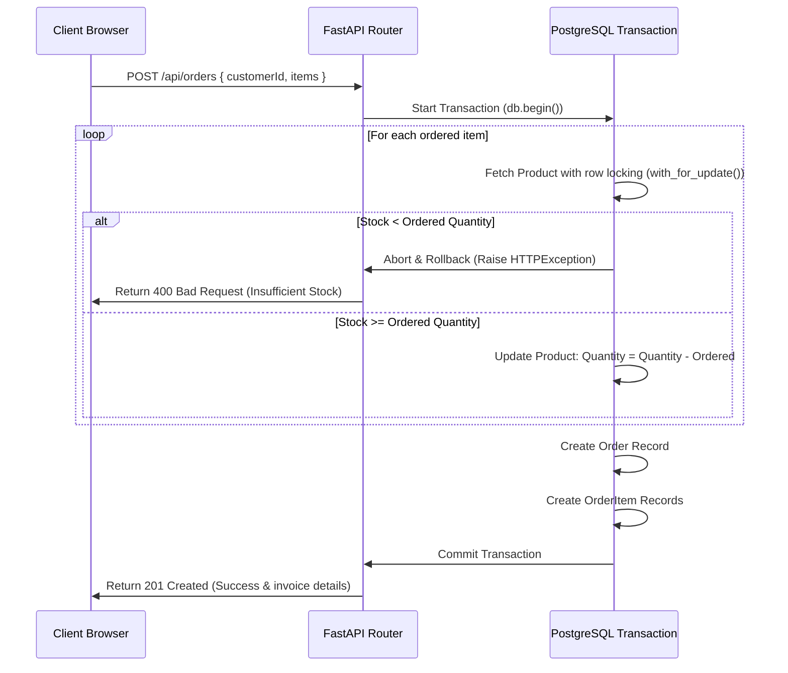

# ApexStock - Inventory & Order Management System

ApexStock is a modern, high-performance, containerized Inventory & Order Management System. It is built as a multi-container microservice stack managed by Docker Compose, featuring a **Vite + React** frontend served by **Nginx Alpine**, a **Python FastAPI** REST API, and a **PostgreSQL** database managed via **SQLAlchemy ORM**.

### 🌐 Live Deployments
- **Frontend App**: [https://apex-stock.vercel.app/](https://apex-stock.vercel.app/)
- **Backend API**: [https://apexstock-backend.onrender.com](https://apexstock-backend.onrender.com)

---

## 🗺️ System Architecture Flowchart

The following flowchart visualizes how the frontend, backend container, and database communicate and execute end-to-end operations:


---

## 📂 Project Directory Structure

```
"Inventory & Order Management System"/
├── docker-compose.yml         # Container orchestration (Exposes ports 5173, 5000, 5432)
├── README.md                  # System operation guide
├── backend/                   # Backend Microservice
│   ├── Dockerfile             # Production build (Python 3.11 Alpine)
│   ├── requirements.txt       # Python dependencies (FastAPI, SQLAlchemy, psycopg2-binary)
│   └── app/
│       ├── __init__.py        # Package marker
│       ├── database.py        # SQLAlchemy engine and session pool setup
│       ├── models.py          # SQLAlchemy schema models (Customer, Product, Order, OrderItem)
│       ├── schemas.py         # Pydantic schemas for request validation & response mapping
│       ├── seed.py            # Database seeding script (pre-populates demo tables)
│       └── main.py            # FastAPI main application and endpoint routes
└── frontend/                  # Frontend Microservice
    ├── Dockerfile             # Multi-stage production build (Node.js Build -> Nginx Alpine)
    ├── package.json           # Vite and React dependencies
    ├── index.html             # HTML entry point (loads custom Google Fonts)
    ├── vite.config.js         # Dev/build compiler configurations
    ├── .env                   # Compile-time build variables (VITE_API_URL)
    └── src/
        ├── main.jsx           # React initialization
        ├── App.jsx            # Core UI layout, views, forms, and client logic
        └── index.css          # Design tokens, custom animations, and responsive media rules
```

---

## 🔄 End-to-End Application Processes

### Process 1: Container Orchestration & Healthchecks
1. **Container Bootstrap**: When `docker compose up` is executed, Docker reads the `docker-compose.yml` configurations.
2. **Database First**: The database container (`inventory_db`) launches. It has a `healthcheck` defined:
   ```yaml
   test: ["CMD-SHELL", "pg_isready -U postgres -d inventory_db"]
   ```
3. **Dependency Blocking**: The backend service (`inventory_backend`) has a blocking dependency condition:
   ```yaml
   depends_on:
     db:
       condition: service_healthy
   ```
   FastAPI waits to start until PostgreSQL is fully healthy and accepting sockets, preventing boot-time database connection errors.

---

### Process 2: Database Migration & Automated Seeding
1. **Startup Script**: At boot, the backend container executes its startup command chain:
   ```bash
   python -m app.seed && uvicorn app.main:app --host 0.0.0.0 --port 5000
   ```
2. **Table Schema Creation**: The database seed script calls:
   ```python
   Base.metadata.create_all(bind=engine)
   ```
   This automatically reads our SQLAlchemy tables and creates them inside PostgreSQL if they do not exist.
3. **Automated Seeding**: The system executes [seed.py](file:///r:/Inventory%20&%20Order%20Management%20System/backend/app/seed.py) to purge tables and populate initial mock records:
   * **3 Customers** (Acme Corp, Jane Doe, Wayne Enterprises)
   * **4 Products** (ThinkPad laptop, UltraWide monitor, wireless mouse, ergonomic chair)
   * **4 Orders** in various states (`PENDING`, `SHIPPED`, `DELIVERED`, `CANCELLED`) to populate the charts.

---

### Process 3: API Request Routing (Backend App)
1. **FastAPI Initialization**: The [main.py](file:///r:/Inventory%20&%20Order%20Management%20System/backend/app/main.py) app configures the router and CORS middleware.
2. **Interactive Swagger Docs**: FastAPI automatically mounts the interactive Swagger UI playground on **`http://localhost:5000/docs`** for live endpoint testing.
3. **Router Handlers**: Main routes handle queries:
   * `GET /api/analytics`: Calculates KPI sums, compiles sales trends from the past 7 days, and lists low-stock alarms.
   * `GET/POST/PUT/DELETE /api/products`: Manages products and stock status badges.
   * `GET/POST/PUT/DELETE /api/customers`: Manages customer directories.
   * `GET/POST/PUT /api/orders`: Manages invoices and status changes.

---

### Process 4: Order Creation & Inventory Transaction
When a user clicks "Confirm Checkout" inside the checkout form, the backend processes the order using a strict **database transaction**:



This sequence prevents race conditions. Row locking (`with_for_update()`) blocks concurrent operations on the product stock while the checkout is running. If an order fails due to insufficient stock on *any* item, the transaction is rolled back, preserving database integrity.

---

### Process 5: Order Status Transitions & Stock Corrections
To keep inventory status accurate, changing an order status via the fulfillment dropdown checks for stock refunds and corrections:
* **Fulfillment (`PENDING` ➔ `SHIPPED` / `DELIVERED`)**: The order remains finalized. No stock changes are needed since stock was already deducted at checkout.
* **Cancellation (Active ➔ `CANCELLED`)**: When status becomes `CANCELLED`, the system initiates a transaction, loops through the ordered items, and **refunds (increments)** the stock back to the products.
* **Restoration (`CANCELLED` ➔ `PENDING`/`SHIPPED`)**: If a user re-opens a cancelled order, the system validates that stock is still available in the warehouse, **deducts** the stock, and transitions the order. If stock is no longer available, the transition fails and returns a `400 Bad Request`.

---

### Process 6: Frontend Serving & Responsive Layouts
1. **Production Serving (Vite + React SPA via Nginx)**: The production multi-stage Docker builder compiles the React frontend assets using **Vite**. These static production bundles are then copied to `/usr/share/nginx/html` and served by a high-performance **Nginx Alpine** web server on container port `80` (mapped to host port `5173`).
2. **Vite Environment Loader**: Build-time environment variables (like `VITE_API_URL`) are read from [frontend/.env](file:///r:/Inventory%20&%20Order%20Management%20System/frontend/.env) and compiled directly into the production JS bundles.
3. **Layout Adaptations (CSS Media Breakpoints)**:
   * **Desktop View**: Renders a fixed sidebar on the left and full-width metrics grids.
   * **Tablet/Mobile View (Widths < 768px)**: The sidebar is slid off-screen. A top header bar is displayed containing a hamburger menu button. Clicking it slides the sidebar in as a drawer overlay.
   * **Table Responsiveness (`.hide-mobile`)**: To prevent wide tables from breaking layouts, secondary columns (like product category, date, email address, and phone) are hidden automatically on mobile screens. The container allows horizontal scrolling (`overflow-x: auto; min-width: 0`) for any remaining data columns.

---

## 🚀 How to Run the Application

### Prerequisites
* Docker Desktop installed and running.
* No local processes running on ports `5173`, `5000`, `8080`, or `5432`.

### Step 1: Start the services
From your project's root folder (`r:\Inventory & Order Management System`), run:
```powershell
docker compose up --build -d
```
*This command compiles the FastAPI backend, packages Vite assets, launches Nginx, boots PostgreSQL, and runs migrations and database seeding in detached background mode.*

### Step 2: Stop the services
To stop the containers and free up ports, run:
```powershell
docker compose down
```

---

## 🗄️ Database & Container Inspection

Once the services are booted up, you can inspect their internal states:

### 1. Standalone Database Clients (DBeaver, TablePlus, pgAdmin)
Connect to the database container using your favorite client with these credentials:
* **Host**: `localhost`
* **Port**: `5432`
* **User**: `postgres`
* **Password**: `postgrespassword`
* **Database**: `inventory_db`

### 2. Container Live Log Monitoring
To monitor real-time server print outputs or trace errors:
* **All Services**: `docker compose logs -f`
* **Backend Only**: `docker logs -f inventory_backend`
* **Frontend Only**: `docker logs -f inventory_frontend`
