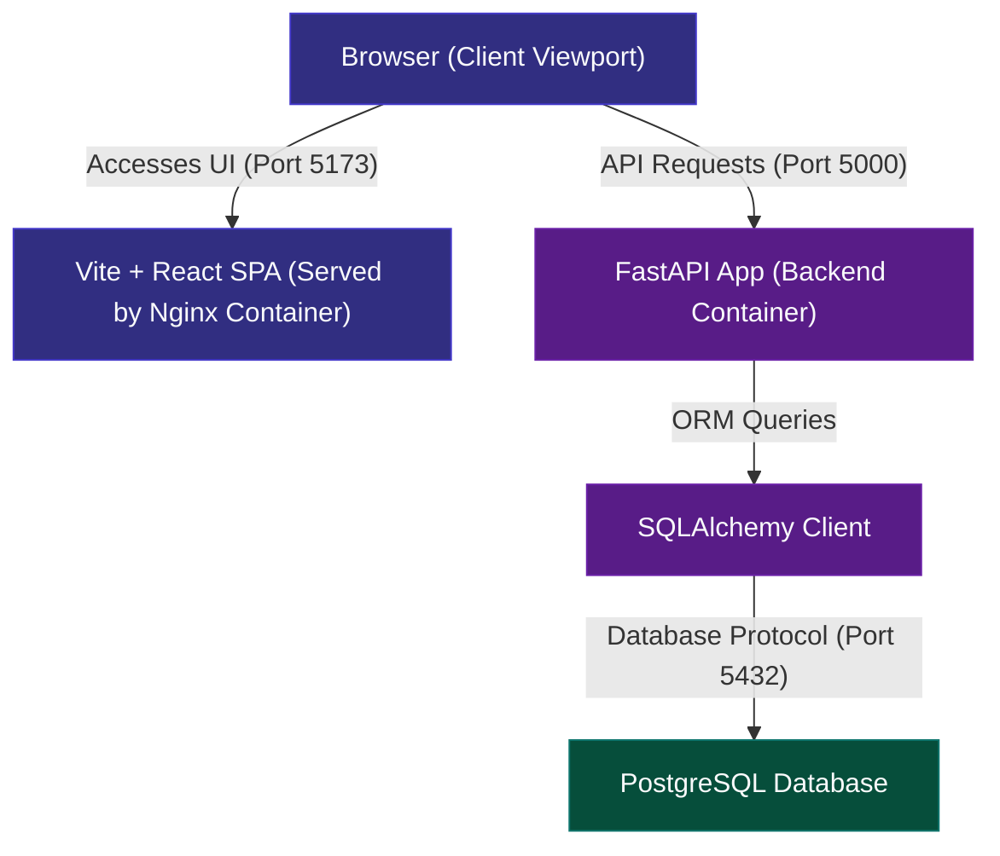

# ApexStock - Inventory & Order Management System

ApexStock is a modern, containerized Inventory & Order Management System. It is built as a multi-container stack managed by Docker Compose, featuring a **Vite + React** frontend served by **Nginx**, a **Python FastAPI** REST API, and a **PostgreSQL** database.

### 🌐 Live Deployments
- **Frontend App**: [https://apex-stock.vercel.app/](https://apex-stock.vercel.app/)
- **Backend API**: [https://apexstock-backend.onrender.com](https://apexstock-backend.onrender.com)

---

## 🗺️ System Architecture

The following flowchart visualizes how the frontend client, backend container, and database communicate:



---

## 📂 Project Directory Structure

```
ApexStock/
├── docker-compose.yml         # Docker orchestration
├── backend/                   # FastAPI backend & DB models
└── frontend/                  # React frontend & styling
```

---

## 🚀 How to Run the Application

### Prerequisites
- Docker Desktop installed and running.
- Ensure ports `5173`, `5000`, and `5432` are free.

### Step 1: Start the services
From the project's root folder, run:
```powershell
docker compose up --build -d
```
*This command builds the images, boots the Postgres database, runs database seeding, and starts the frontend and backend servers.*

### Step 2: Stop the services
To stop the containers and free up ports, run:
```powershell
docker compose down
```

---

## 🗄️ Database & Container Inspection

Once the services are running, you can connect to the database or view live logs:

### 1. Database Connection
Connect to the database container (e.g. using DBeaver or TablePlus):
- **Host**: `localhost`
- **Port**: `5432`
- **User**: `postgres`
- **Password**: `postgrespassword`
- **Database**: `inventory_db`

### 2. Live Logs
- **All Services**: `docker compose logs -f`
- **Backend Only**: `docker logs -f inventory_backend`
- **Frontend Only**: `docker logs -f inventory_frontend`
